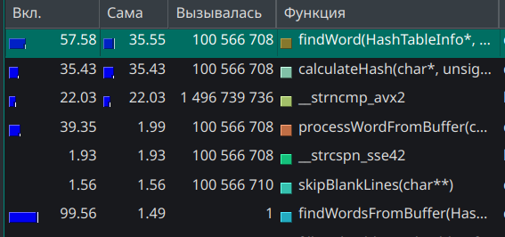

# Хеш-таблица

## Оглавление
- [Хеш-таблица](#хеш-таблица)
  - [Оглавление](#оглавление)
  - [Аннотация](#аннотация)
- [Введение](#введение)
- [Используемое оборудование и ПО](#используемое-оборудование-и-по)
  - [Аппаратные характеристики](#аппаратные-характеристики)
  - [Профилировщики](#профилировщики)
- [Цель и задачи](#цель-и-задачи)
- [Ход Работы](#ход-работы)
- [Итоги](#итоги)

## Аннотация

Данная работа была проведена в рамках учебного курса информатики. Основной целью работы являлась работа с различными способами аппаратно-зависимой оптимизации. В качестве объекта для оптимизации выбрана хеш-таблица. В данной работе рассматривается хеш-таблица с разрешением коллизий методом списков. В ходе работы хеш-таблица заполнялась английскими словами, взятыми из переведённой на английский язык книги Л. Н. Толстого "Война и мир". Заполнение хеш-таблицы происходило с перегрузкой load-фактора, что связано с учебной целью задачи. Также существует функция поиска совпадающих слов в хеш-таблице, именно на ней установлен фокус всех проведённых работ. Для нагрузки функции поиска я использовал файл длинной в 100 миллионов строк, состоящий из пяти- и шестизначных комбинаций букв английского алфавита, стоящих по одной в строке. 

Для выбора функции для оптимизации использовался профилировщик `valgrind` и графическая оболочка для него `kcachegrind`.

В ходе работы исследованы следующие способы оптимизации:
- Оптимизация компилятором.
- Оптимизация с помощью intrinsic-ов.
- Использование ассемблерной вставки.
- Написание выбранной функции на nasm в отдельном файле.

Рассмотрим полученные результаты. 

Начальное время работы программы составляло: $24.70±0.30сек$

Время работы крайней версии: $7.08±0.08сек$

Что в итоге дало увеличение производительности программы в $$\frac{7.08}{24.70} ≈ 3.49$$ раз.

## Введение

**Хеш-таблица** — это структура данных, которая позволяет хранить значения используя для доступа к ним *ключ* и обеспечивает эффективный поиск, вставку и удаление элементов (в этой работе удаление элементов не рассмотрено). Устройство хеш таблицы позволяет выполнять эти операции за O(1), но при неудачной реализации время может возрасти до O(n).

**Хеш-функция** — это алгоритм, преобразующий ключ в числовой индекс (хеш), который определяет позицию элемента в таблице.
Требования к хорошей хеш-функции:
- Равномерность: Равномерное распределение ключей по таблице.
- Детерминированность: Один и тот же ключ всегда даёт одинаковый хеш.
- Быстрота вычисления.

**Load-фактор** - характеристика хеш таблицы, вычисляется по формуле: $$\frac{\text{Число  элементов}}{\text{Размер  таблицы}}$$.

Обычно в хеш-таблицах находится на уровне ≈ 1, но в учебных целях, в этой работе load-фактор сильно завышен и равняется примерно 15.

**Коллизия** — ситуация совпадающего хеша для разных ключей. Существует два основных метода разрешения коллизий:

Открытая адресация: Поиск продолжается до тех пор, пока не будет найдена свободная ячейка.

Метод цепочек: Элементы с одинаковым хешом хранятся в связном списке.

В работе мы используем метод цепочек, реалезуемый с помощью [двусвязного списка](https://github.com/obzix-128/List).

**Двусвязный список** — структура данных, где каждый узел содержит:
-Данные.
-Указатель на следующий узел (next).
-Указатель на предыдущий узел (prev).

## Используемое оборудование и ПО

### Аппаратные характеристики

Работа проводилась на следующей аппаратуре:

<table>
  <tr>
    <th colspan="2">Системные характеристики</th>
  </tr>
  <tr>
    <td><strong>Модель ноутбука</strong></td>
    <td>Thunderobot 911S Core D</td>
  </tr>
  <tr>
    <td><strong>Операционная система</strong></td>
    <td>Manjaro Linux</td>
  </tr>
  <tr>
    <td><strong>Процессор</strong></td>
    <td>12th Gen Intel Core i5-12450H (Alder Lake)</td>
  </tr>
  <tr>
    <td><strong>Архитектура</strong></td>
    <td>x86_64</td>
  </tr>
  <tr>
    <td><strong>Техпроцесс</strong></td>
    <td>Intel 7 (10nm Enhanced SuperFin)</td>
  </tr>
  <tr>
    <td><strong>Ядра/потоки</strong></td>
    <td>8 ядер (4P+4E)/12 потоков</td>
  </tr>
  <tr>
    <td><strong>Тактовая частота</strong></td>
    <td>0.4-4.4 GHz (P-ядра), 0.4-3.3 GHz (E-ядра)</td>
  </tr>
  <tr>
    <td><strong>Оперативная память</strong></td>
    <td>16 GB</td>
  </tr>
</table>

### Профилировщики

Для выбора функции для оптимизации в работе использовался профилировщик `valgrind` и графическая оболочка для него `kcachegrind`.

## Цель и задачи

**Цель работы** - освоение различных методик аппаратно-зависимой оптимизации и обучение работе с профилировщиками на примере оптимизации алгоритма поиска хеш-таблицы.

Разобъем цель на подзадачи:

1. Написание хеш-таблицы.
2. Рефакторинг написанного кода, без его оптимизации.
3. Анализ полученной программы профилировщиком и, на основе полученных данных, выбор участков кода для оптимизации.
4. Проведение одной из оптимизаций:
  - Оптимизация компилятором с помощью флага компиляции `-O3`.
  - Оптимизация с помощью intrinsic-ов.
  - Использование ассемблерной вставки.
  - Написание выбранной функции на nasm в отдельном файле.
5. Анализ проведённой оптимизации, её влияния на код программы. В случае неэффективной оптимизации отмена внесённых изменений.
6. Возвращение к пункту `3`, пока не будут проведены все запланированные оптимизации.
7. Анализ результатов.

## Ход работы

Начнём достижение наших целей, двигаясь по списку подзадач. Первые два шага необходимы, но в контексте задачи не слишком интересны, поэтому опустим их выполнение и перейдём сразу к описанию третьего шага.

Итак, написав программу, приступаем к её анализу. 

 

Рисунок 1. Первая версия программы без каких-либо оптимизаций
 
  

## Итоги
