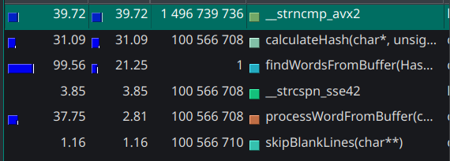
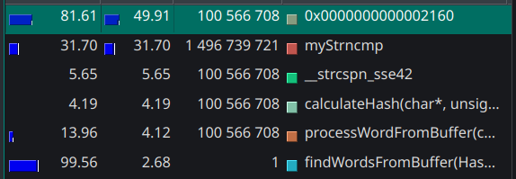

# Хеш-таблица

## Оглавление
- [Хеш-таблица](#хеш-таблица)
  - [Оглавление](#оглавление)
  - [Аннотация](#аннотация)
- [Введение](#введение)
- [Используемое оборудование и ПО](#используемое-оборудование-и-по)
  - [Аппаратные характеристики](#аппаратные-характеристики)
  - [Профилировщики](#профилировщики)
- [Цель и задачи](#цель-и-задачи)
- [Ход Работы](#ход-работы)
- [Итоги](#итоги)

## Аннотация

Данная работа была проведена в рамках учебного курса информатики. Основной целью работы являлась работа с различными способами аппаратно-зависимой оптимизации. В качестве объекта для оптимизации выбрана хеш-таблица. 

В данной работе рассматривается хеш-таблица с разрешением коллизий методом списков. В ходе работы хеш-таблица заполнялась английскими словами, взятыми из переведённой на английский язык книги Л. Н. Толстого "Война и мир". Заполнение хеш-таблицы происходило с перегрузкой load-фактора, что связано с учебной целью задачи. Также существует функция поиска совпадающих слов в хеш-таблице, именно на ней установлен фокус всех проведённых работ. Для нагрузки функции поиска использовался файл длинной в 100 миллионов строк, состоящий из пяти- и шестизначных комбинаций букв английского алфавита, стоящих по одной в строке. 

Для выбора функции для оптимизации использовался профилировщик `valgrind` и графическая оболочка для него `kcachegrind`.

В ходе работы исследованы следующие способы оптимизации:
- Оптимизация компилятором.
- Оптимизация с помощью intrinsic-ов.
- Использование ассемблерной вставки.
- Написание выбранной функции на nasm в отдельном файле.

Рассмотрим полученные результаты. 

Начальное время работы программы составляло: $24.70±0.30сек$

Время работы крайней версии: $7.08±0.08сек$

Что в итоге дало увеличение производительности программы в $$\frac{7.08}{24.70} ≈ 3.49$$ раз.

## Введение

**Хеш-таблица** — это структура данных, которая позволяет хранить значения используя для доступа к ним *ключ* и обеспечивает эффективный поиск, вставку и удаление элементов (в этой работе удаление элементов не рассмотрено). Устройство хеш таблицы позволяет выполнять эти операции за O(1), но при неудачной реализации время может возрасти до O(n).

**Хеш-функция** — это алгоритм, преобразующий ключ в числовой индекс (хеш), который определяет позицию элемента в таблице.
Требования к хорошей хеш-функции:
- Равномерность: Равномерное распределение ключей по таблице.
- Детерминированность: Один и тот же ключ всегда даёт одинаковый хеш.
- Быстрота вычисления.

**Load-фактор** - характеристика хеш таблицы, вычисляется по формуле: $$\frac{\text{Число  элементов}}{\text{Размер  таблицы}}$$.

Обычно в хеш-таблицах находится на уровне ≈ 1, но в учебных целях, в этой работе load-фактор сильно завышен и равняется примерно 15.

**Коллизия** — ситуация совпадающего хеша для разных ключей. Существует два основных метода разрешения коллизий:

- Открытая адресация: Поиск продолжается до тех пор, пока не будет найдена свободная ячейка.

- Метод цепочек: Элементы с одинаковым хешом хранятся в связном списке.

В работе мы используем метод цепочек, реализуемый с помощью [двусвязного списка](https://github.com/obzix-128/List).

**Двусвязный список** — структура данных, где каждый узел содержит:
- Данные.
- Указатель на следующий узел (next).
- Указатель на предыдущий узел (prev).

## Используемое оборудование и ПО

### Компилятор

В работе используется компилятор g++.

### Аппаратные характеристики

Работа проводилась на следующей аппаратуре:

<table>
  <tr>
    <th colspan="2">Системные характеристики</th>
  </tr>
  <tr>
    <td><strong>Модель ноутбука</strong></td>
    <td>Thunderobot 911S Core D</td>
  </tr>
  <tr>
    <td><strong>Операционная система</strong></td>
    <td>Manjaro Linux</td>
  </tr>
  <tr>
    <td><strong>Процессор</strong></td>
    <td>12th Gen Intel Core i5-12450H (Alder Lake)</td>
  </tr>
  <tr>
    <td><strong>Архитектура</strong></td>
    <td>x86_64</td>
  </tr>
  <tr>
    <td><strong>Техпроцесс</strong></td>
    <td>Intel 7 (10nm Enhanced SuperFin)</td>
  </tr>
  <tr>
    <td><strong>Ядра/потоки</strong></td>
    <td>8 ядер (4P+4E)/12 потоков</td>
  </tr>
  <tr>
    <td><strong>Тактовая частота</strong></td>
    <td>0.4-4.4 GHz (P-ядра), 0.4-3.3 GHz (E-ядра)</td>
  </tr>
  <tr>
    <td><strong>Оперативная память</strong></td>
    <td>16 GB</td>
  </tr>
</table>

### Профилировщики

Для выбора функции для оптимизации в работе использовался профилировщик `valgrind` и графическая оболочка для него `kcachegrind`.

## Цель и задачи

**Цель работы** - освоение различных методик аппаратно-зависимой оптимизации и обучение работе с профилировщиками на примере оптимизации алгоритма поиска хеш-таблицы.

Разобъем цель на подзадачи:

1. Написание хеш-таблицы.
2. Рефакторинг написанного кода, без его оптимизации.
3. Анализ полученной программы профилировщиком и, на основе полученных данных, выбор участков кода для оптимизации.
4. Проведение одной из оптимизаций:
  - Оптимизация компилятором с помощью флага компиляции `-O3`.
  - Оптимизация с помощью intrinsic-ов.
  - Использование ассемблерной вставки.
  - Написание выбранной функции на nasm в отдельном файле.
5. Анализ проведённой оптимизации, её влияния на код программы. В случае неэффективной оптимизации отмена внесённых изменений.
6. Возвращение к пункту `3`, пока не будут проведены все запланированные оптимизации.
7. Анализ результатов.

## Ход работы

Начнём достижение наших целей, двигаясь по списку подзадач. Первые два шага необходимы, но в контексте задачи не слишком интересны, поэтому опустим их выполнение и перейдём сразу к описанию третьего шага.

Итак, написав программу, приступаем к её анализу с помощью `valgrind`. 

<div align="center"></div><br>
<div align="center">Рисунок 1. Первая версия программы без каких-либо оптимизаций</div><br>
  
На этом этапе время работы программы составляло: 24.70±0.30сек. Время было измерено с помощью функции `clock()` из стандартной бибилиотеки `<time.h>`.

<details>
<summary>Полные результаты измерений</summary>

| № измерения | Время (секунды) |
|-------------|-----------------|
| 1           | 24.5891         |
| 2           | 24.5892         |
| 3           | 24.4298         |
| 4           | 24.4872         |
| 5           | 25.3646         |
| 6           | 24.7938         |
| 7           | 24.7013         |
| 8           | 25.2242         |
| 9           | 25.0466         |
| 10          | 24.8036         |

</details>
<br>

Теперь оптимизируем нашу программу с помощью перекомпилирования с флагом `-O3`.

<div align="center"></div><br>
<div align="center">Рисунок 2. Оптимизация флагом -O3.</div><br>

Компилятор успешно справился со своей задачей. Теперь среднее время работы программы составляет 15.47 ± 0.18 сек. Программа ускорилась в $$\frac{24,70}{15,47} ≈ 1,60$$ раз.

<details>
<summary>Полные результаты измерений</summary>

| № измерения | Время (секунды) |
|-------------|-----------------|
| 1           | 15.2228         |
| 2           | 15.2320         |
| 3           | 15.2877         |
| 4           | 15.3292         |
| 5           | 15.7213         |
| 6           | 15.6915         |
| 7           | 15.5691         |
| 8           | 15.6360         |
| 9           | 15.5541         |
| 10          | 15.4188         |

</details>
<br>

С помощью профилировщика легко определить следующую цель для оптимизации - __strncmp_avx2. 

Попробуем написать свою собственную версию `strncmp` на intrinsic-ах:

<details>
<summary>Код функции myStrncmp</summary>

```cpp
int myStrncmp(char *str_one, char *str_two, size_t num) 
{
    __m256i first  = _mm256_loadu_si256((__m256i*)(str_one));
    __m256i second = _mm256_loadu_si256((__m256i*)(str_two));

    __m256i cmp = _mm256_cmpeq_epi8(first, second);
                  
    uint32_t mask = _mm256_movemask_epi8(cmp);

    if(mask != 0xFFFFFFFF) 
    {
        if(__builtin_ctz(~mask) < num)
        {
            return 1;
        }
    }

    return 0;
}
```

</details>
<br>

И вновь производим профилирование программы.

<div align="center"></div><br>
<div align="center">Рисунок 3. Оптимизация intrinsic-ами.</div><br>

Как можно заметить, функция `strncmp` пропала, но и `myStrncmp` не появилась. Несложно догадаться, что компилятор вместо вызова `myStrncmp` подставил код функции в `findWord`. Для анализа эффективности оптимизации запретим ему это делать и посмотрим, какую долю от общего времени работы программы теперь занимает `myStrncmp`.

<div align="center"></div><br>
<div align="center">Рисунок 4. noinline myStrncmp.</div><br>

Измеряем время и получаем 11.81±0.13 сек. После переписывания `strncmp` на intrinsic-ах программа ускорилась в $$\frac{15,47}{11,81} ≈ 1,31$$ раз.

<details>
<summary>Полные результаты измерений</summary>

| № измерения | Время (секунды) |
|-------------|-----------------|
| 1           | 11.7131         |
| 2           | 11.8334         |
| 3           | 11.6522         |
| 4           | 11.6286         |
| 5           | 11.7417         |
| 6           | 11.7390         |
| 7           | 11.8454         |
| 8           | 12.0577         |
| 9           | 11.9903         |
| 10          | 11.9442         |

</details>
<br>

Наверху списка теперь оказалась функция подсчёта хэша `calculateHash`. Применим к ней оптимизацию ассемблерной вставкой. Ниже приведён изначальный код функции и оптимизированный.

<details>
<summary>Изначальный код функции calculateHash</summary>

```cpp
uint32_t calculateHash(char *word, size_t length) 
{
    uint32_t crc = 0xFFFFFFFF;

    for(size_t i = 0; i < length; i++) 
    {
        crc ^= word[i];
        for(int j = 0; j < 8; j++) 
        {
            crc = (crc >> 1) ^ (0x82F63B78 & -(crc & 1));
        }
    }
    return ~crc;
}
```

</details>
<br>

<details>
<summary>Оптимизированный код функции calculateHash</summary>

```cpp
uint32_t calculateHash(char* word, size_t length)
{
    uint32_t hash = 0xFFFFFFFF;

    __asm__ volatile (
        ".intel_syntax noprefix\n"        // Переключаемся на Intel-синтаксис
        "mov %[h], 0xFFFFFFFF\n"          // Инициализация hash = 0xFFFFFFFF
        "test %[len], %[len]\n"           // Проверка длины (length == 0?)
        "jz .Ldone\n"                     // Если длина 0, пропустить цикл
        ".Lloop:\n"
        "crc32 %[h], byte ptr [%[ptr]]\n" // CRC32 для текущего байта (Intel-синтаксис)
        "inc %[ptr]\n"                    // Переход к следующему байту
        "dec %[len]\n"                    // Уменьшение счётчика
        "jnz .Lloop\n"                    // Повторять, пока len != 0
        ".Ldone:\n"
        "not %[h]\n"                      // Инвертирование битов (финальный шаг CRC32)
        ".att_syntax prefix\n"            // Возвращаемся к AT&T-синтаксису (по умолчанию в GCC)
        : [h] "+r" (hash)                 // Выход: обновлённый hash
        : [ptr] "r" (word),               // Вход: указатель на строку
          [len] "r" (length)              // Вход: длина строки
        : "cc", "memory"                  // Сообщаем компилятору о изменении флагов и памяти
    );

    return hash;
}
```

</details>
<br>

Профилируем программу и получаем:

<div align="center"></div><br>
<div align="center">Рисунок 5. После оптимизации calculateHash.</div><br>

Оптимизация функции подсчёта хэша прошла успешно и она опустилась по списку вниз. Время работы программы 7.61±0.08 сек. Программа ускорилась в $$\frac{11,81}{7,61} ≈ 1,55$$ раз.

<details>
<summary>Полные результаты измерений</summary>

| № измерения | Время (секунды) |
|-------------|-----------------|
| 1           | 7.6131          |
| 2           | 7.5494          |
| 3           | 7.6232          |
| 4           | 7.5077          |
| 5           | 7.7099          |
| 6           | 7.6334          |
| 7           | 7.7231          |
| 8           | 7.6533          |
| 9           | 7.5055          |
| 10          | 7.6283          |

</details>
<br>

Функция `myStrncmp` оказалась вверху списка, но её мы уже оптимизировали, а на второй строчке, с небольшим отставанием находится функция `findWord`. Попробуем оптимизировать её, переписав на nasm. Ниже приведён изначальный код `findWord` и оптимизированный. В оптимизированной версии мы не будем писать дебажные проверки на нулевые адреса.

<details>
<summary>Изначальный код функции findWord</summary>

```cpp
ErrorNum findWord(HashTableInfo* hash_table, char* buffer, uint32_t hash, size_t length, int* value)
{
    CHECK_NULL_ADDR_ERROR(hash_table, NULL_ADDRESS_ERROR);
    CHECK_NULL_ADDR_ERROR(buffer,     NULL_ADDRESS_ERROR);
    CHECK_NULL_ADDR_ERROR(value,      NULL_ADDRESS_ERROR);

    for(int i = hash_table->bucket[hash].list.cell[0].next; i != 0; i = hash_table->bucket[hash].list.cell[i].next) 
    {
        if(!myStrncmp(hash_table->buffer + hash_table->bucket[hash].list.cell[i].data, buffer, length)) 
        { 
            if((hash_table->buffer + hash_table->bucket[hash].list.cell[i].data)[length] == '\0')
            {
                hash_table->bucket[hash].num_occurrences += 1;
                *value = hash_table->bucket[hash].list.cell[i].data;
                break;
            }
        }
    }

    return NO_ERROR;
}
```

</details>
<br>

<details>
<summary>Оптимизированный код функции findWord</summary>

```cpp
; ErrorNum findWord(HashTableInfo* hash_table, char* buffer, size_t hash, size_t length, int* value)
findWord:
    push r12
    push r13
    push r14
    push r15
    push rbx

    ; Сохраняем аргументы
    mov r12, rdi        ; hash_table
    mov r13, rsi        ; buffer
    mov r14, rdx        ; hash
    mov r15, rcx        ; length
    mov rbx, r8         ; value (5-й аргумент, теперь в rbx)

    ; Получаем bucket[hash].list.cell[0].next
    mov rax, [r12]      ; hash_table->bucket
    imul rdx, r14, 32   ; hash * sizeof(Bucket_t) = 32
    add rax, rdx        ; bucket[hash]
    mov rsi, [rax]      ; bucket.list.cell (ListCell_t*)
    mov edi, [rsi + 4]  ; cell[0].next (offset 4)

.loop:
    test edi, edi       ; i == 0?
    jz .success

    ; Вычисляем адрес cell[i]
    mov eax, edi        ; i
    imul rax, rax, 12   ; sizeof(ListCell_t) = 12
    lea r10, [rsi + rax] ; &cell[i]
    
    mov r11d, [r10] ; Сохраняем cell[i].data

    push r11
    ; Вызов myStrncmp
    mov rdx, [r12 + 8]  ; hash_table->buffer
    add rdx, r11        ; buffer + cell[i].data
    mov rdi, rdx        ; 1-й аргумент myStrncmp
    mov rsi, r13        ; 2-й аргумент (buffer)
    mov rdx, r15        ; 3-й аргумент (length)
    call myStrncmp
    pop r11

    test eax, eax
    jnz .next_iter

    ; Проверка на '\0'
    mov r8, [r12 + 8]   ; hash_table->buffer
    add r8, r11         ; + cell[i].data
    add r8, r15         ; + length
    cmp byte [r8], 0
    jne .next_iter

    ; Нашли совпадение
    mov rax, [r12]       ; hash_table->bucket
    imul rdx, r14, 32    ; hash * 32
    add rax, rdx         ; bucket[hash]
    inc dword [rax + 20] ; num_occurrences++ (offset 20)
    mov eax, r11d        ; cell[i].data
    mov [rbx], eax       ; *value = data
    jmp .success

.next_iter:
    mov edi, [r10 + 4]  ; cell[i].next (offset 4)
    mov rax, [r12]      ; Восстанавливаем rsi
    imul rdx, r14, 32   
    add rax, rdx
    mov rsi, [rax]      
    jmp .loop

.success:
    xor eax, eax        ; NO_ERROR
    pop rbx
    pop r15
    pop r14
    pop r13
    pop r12
    ret
```

</details>
<br>

После оптимизации проверим результаты. 

<div align="center"></div><br>
<div align="center">Рисунок 6. После оптимизации findWord.</div><br>

И в итоге получаем неутешительный результат. Время работы программы составляет 7.71 ± 0.15 сек. Наша оптимизация findWord оказалась в пределах погрешности равна автоматически сгенерированной компилятором с флагом `-O3`.  Относительное замедление соcтавило $$\frac{7.61}{7.71} ≈ 1.013$$ (на 1.3% медленнее)

<details>
<summary>Полные результаты измерений</summary>

| № измерения | Время (секунды) |
|-------------|-----------------|
| 1           | 7.8865          |
| 2           | 7.5563          |
| 3           | 7.4526          |
| 4           | 7.6765          |
| 5           | 7.8438          |
| 6           | 7.8780          |
| 7           | 7.7395          |
| 8           | 7.7746          |
| 9           | 7.7586          |
| 10          | 7.5536          |

</details>
<br>

Результат этой оптимизации оказался неудачным, к тому же была потеряна читаемость кода, поэтому вернёмся к предыдущей версии программы. Также разрешим компилятору inline функции myStrncmp и таким образом получим крайнюю, на данный момент, версию программы.

<div align="center"></div><br>
<div align="center">Рисунок 7. Крайняя версия программы со всеми удачными оптимизациями.</div><br>

Время работы программы теперь составляет 7.08±0.08сек, что относительно первоначальной версии даёт ускорение в $$\frac{7.08}{24.70} ≈ 3.49$$ раз.

<details>
<summary>Полные результаты измерений</summary>

| № измерения | Время (секунды) |
|-------------|-----------------|
| 1           | 6.9785          |
| 2           | 6.9958          |
| 3           | 7.0230          |
| 4           | 7.1750          |
| 5           | 7.0698          |
| 6           | 7.0421          |
| 7           | 7.2109          |
| 8           | 7.1659          |
| 9           | 7.0938          |
| 10          | 7.0674          |

</details>
<br>

## Итоги

Таким образом мы добились поставленной учебной задачи и на этом оптимизация этой программы будет завершена. Было успешно применено три различных способа оптимизации. Успешно удалось применить оптимизацию intrinsic-ами и ассемблерной вставкой. Ручное переписывание функции findWord на nasm не дало результата из-за того, что с оптимизацией этой функции успешно справляется компилятор с флагом `-O3`.
